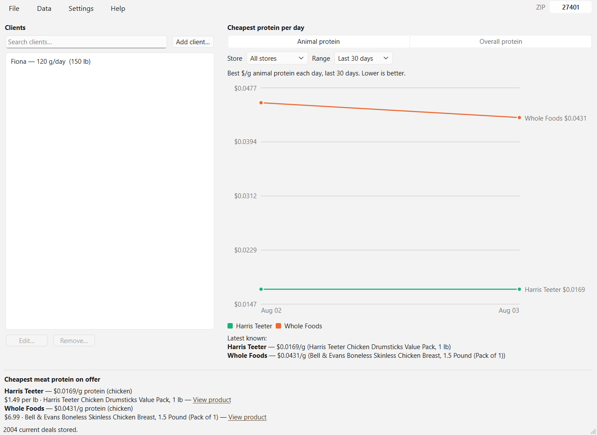
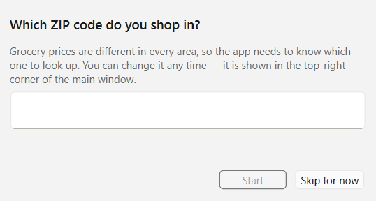
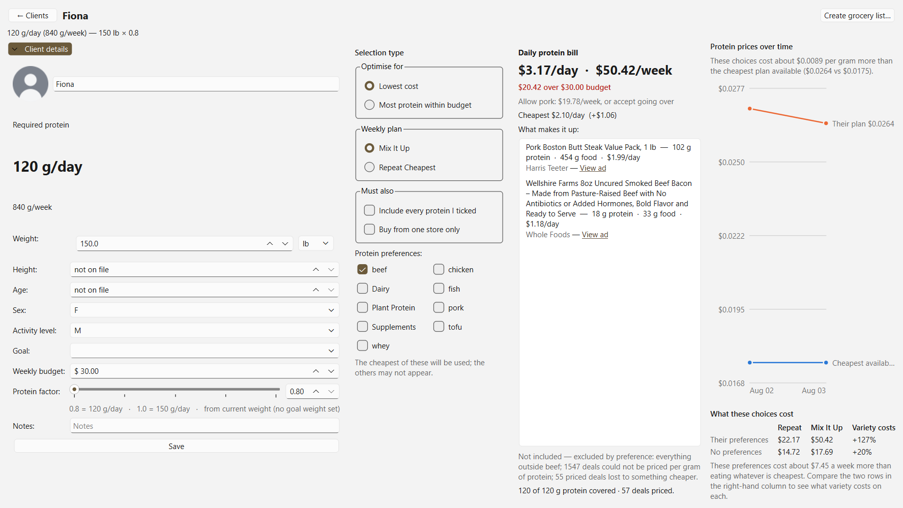

# Protein Ledger


**Work out what a client should eat to hit their protein target for the least
money — and how that changes when their preferences or budget change.**

Built for a nutritionist. Everything runs on your own computer: no account, no
sign-up, no cloud, no subscription. Your clients' details never leave the
machine.



---

## What it does

You tell it a client's weight and what they will and won't eat. It looks at real
supermarket prices and works out:

- **how much protein they need a day**, from their goal weight
- **the cheapest way to actually get it**, item by item, and which shop to go to
- **what their preferences cost them** — "eating only beef costs $7.45 a week
  more than eating whatever is cheapest"
- **whether they fit their weekly budget**, and what to change if they don't

Prices are refreshed automatically, and it keeps a year of price history so you
can see whether things are getting dearer.

---

## Installing it

You need the ZIP file for your computer. **It will be sent to you** — the
project is private, so it is not a public download.

### On a Mac

1. Unzip the file (double-click it).
2. Open **Terminal** (press ⌘ + Space, type `Terminal`, press Enter).
3. Type `cd ` — *with a space after it* — then drag the unzipped folder onto the
   Terminal window and press Enter.
4. Type this and press Enter:

   ```bash
   ./install.sh
   ```

If macOS says the app "cannot be opened because the developer cannot be
verified", run this instead — it is macOS quarantining anything downloaded from
the internet, not a problem with the app:

```bash
./install.sh --clear-quarantine
```

### On Windows

1. Unzip the file (right-click → **Extract All**).
2. Right-click **install.ps1** → **Run with PowerShell**.

If Windows blocks it, open PowerShell in that folder and run:

```powershell
powershell -ExecutionPolicy Bypass -File .\install.ps1
```

That block is Windows' default protection for downloaded scripts. `install.ps1`
is plain text and is meant to be read first if you want to.

---

## First time you open it

It asks which ZIP code you shop in. **This matters** — grocery prices are
different in every area, and the app cannot guess yours.



You can change it later: it is shown in the **top-right corner** of the main
window, and clicking it lets you change it.

### Loading the price key

You will be emailed a small file that lets the app look up prices. Save it
somewhere you can find it, then in the app:

**Settings ▸ Load credential…** → choose the file.

That is the whole setup. You do not need to register anything.

---

## Using it



Add a client, and the page shows everything at once:

| | |
| --- | --- |
| **Client details** (left) | Weight, goal weight, and their weekly budget. Open and close it with the button under their name. |
| **Selection type** | What "best" means for this client — see below. |
| **Daily protein bill** | What it costs per day and per week, what to buy, and where. |
| **Charts** (right) | Their prices over time against the cheapest available, and what their choices cost. |

### The choices you make per client

**Optimise for** — *Lowest cost* (the default) or *Most protein within budget*.

**Weekly plan** — *Mix It Up* varies the week so they are not eating the same
thing seven days running. *Repeat Cheapest* just picks the cheapest thing every
day. Mix It Up costs more, and the app shows you exactly how much.

**Must also** — tick *Include every protein I ticked* to spread the plan across
all of them instead of filling it from whichever is cheapest. Tick *Buy from one
store only* to avoid sending someone to three shops.

**Protein preferences** — tick what they will eat. Ticking nothing means
"anything", not "nothing".

> **The protein target is never reduced.** No setting will quietly feed a client
> less protein to make a plan look cheaper or more varied. Cost gives way, or
> variety gives way — never the nutrition.

### Budgets

Set a weekly budget in **Client details**. If the plan goes over, the app says
so and tells you the cheapest single change that would fix it:

```
$20.42 over $30.00 budget
Allow pork: $19.78/week, or accept going over
```

Going over budget is a legitimate choice. The app will not stop you.

### Prices marked with a symbol

Some prices depend on weight, so the till total can differ:

| | |
| --- | --- |
| `*` | Deli item — price depends on how much is cut for you |
| `**` | Pre-packaged by weight — may be slightly over or under |
| `†` | We could not tell which of the two it is; treat as an estimate |

No symbol means a fixed price for a fixed package.

---

## Getting rid of it

**Mac:** `~/.local/share/protein-ledger/uninstall.sh`
**Windows:** *Add or Remove Programs* → **Protein Ledger**, or run
`uninstall.ps1` from the install folder.

Add `--keep-data` (Mac) or `-KeepData` (Windows) to remove the program but keep
your clients.

---

## Something went wrong

- **"needs credentials"** — the price key has not been loaded. See *Loading the
  price key* above.
- **Prices look like the wrong city** — check the ZIP in the top-right corner.
- **Prices are not updating** — **Data ▸ Run scrape…** does it by hand and shows
  what happened.

---
---

# Developer reference

Everything below is for working on the app rather than using it.

## How it works

```
┌────────────────────┐    gplan scrape     ┌──────────────────────┐    gplan list / formula
│  Flipp flyer API    │  ───────────────▶   │  SQLite (one file)   │  ───────────────▶  you
│  (weekly ads +      │    gplan import     │  deals · prices ·    │    query, filter,
│   digital coupons)  │  ──── CSVs ────▶    │  profile · formulas  │    compare, evaluate
└────────────────────┘                     └──────────────────────┘
```

1. **Collect** — `gplan scrape <store>` pulls a store's active weekly ad plus
   grocery digital coupons and writes normalized rows into the database.
   `gplan import` loads CSVs (`data/<store>/{prices,deals}.csv`) instead.
2. **Store** — one SQLite file in your user-data dir (`gplan db-path`). Disposable:
   delete that one folder and everything is gone.
   Set a cadence with `gplan schedule set <store> --every 12h` and run
   `gplan schedule run` to keep it fresh by itself. The schedule lives in the
   database, so it survives restarts, and anything missed while the machine was
   asleep is caught up on the next start rather than skipped.
3. **Compare** — `gplan list deals|prices` to browse/filter; `gplan best` to rank
   deals by cost per ounce/each (or by your own formula); `gplan formula` to
   evaluate your own savings/nutrition expressions against `gplan profile` values.
   Cost-per-unit needs a size in the ad copy, and most weekly-ad names don't have
   one ("Ben & Jerry's Ice Cream"), so `gplan best` reports how many deals it had
   to leave out rather than implying the ad was short.
   Deals whose `valid_to` has passed are marked `(expired)` rather than silently
   shown as current; `--hide-expired` drops them. Every filter is defined once in
   `service.fetch_deals()`, so both front ends always mean the same thing by one.

### Stores

| Store         | Key            | Scraper                        |
|---------------|----------------|--------------------------------|
| Food Lion     | `foodlion`     | ✅ weekly ad + digital coupons |
| Harris Teeter | `harristeeter` | ✅ weekly ad + digital coupons |
| Whole Foods   | `wholefoods`   | ⏳ manual CSV for now (GFP-4)  |

The Flipp dependency (undocumented, unauthenticated `flippback.com` endpoints —
no license fee, but ToS/breakage/rate-limit risk) is isolated in one place:
`grocery_planner/scrapers/base.py`. Adding a Flipp-backed store is a thin module
plus a registry entry (see `foodlion.py` / `harristeeter.py`).

---

## Install

Requires Python 3.11+.

```powershell
python -m venv .venv
.venv\Scripts\python -m pip install -e ".[dev]"
```

Then run via `.venv\Scripts\gplan.exe` (or activate the venv and use `gplan`).

> On Windows the `gplan` name is used deliberately — `gp` is a built-in
> PowerShell alias for `Get-ItemProperty`.

---

## Commands

```
gplan scrape <store> [-z ZIP]      fetch fresh weekly ad + coupons into the DB
gplan import [DATA_DIR]            load data/<store>/{prices,deals}.csv into the DB
gplan list deals  [-s STORE] [-n N] [--on-sale] [--hide-expired]
                  [-c CATEGORY] [-t all|weekly|coupon|bogo] [-q SEARCH]
                  [--loyalty] [--valid-on YYYY-MM-DD]
gplan list prices [-s STORE] [-n N]
gplan categories  [-s STORE]      sub-categories available to --category
gplan best [-s STORE] [-c CATEGORY] [-q SEARCH] [-u oz|"fl oz"|each]
           [--score FORMULA] [-n N]   rank deals by value
gplan export FILE.csv [-s STORE] [-c CATEGORY] [-q SEARCH]
gplan stores                      tracked stores + row counts
gplan db-path                     print the SQLite database path
gplan credentials                 which credentials are set up, and where
gplan schedule set STORE --every 6h | --cron "0 6 * * *"
gplan schedule list | remove STORE
gplan schedule run [--once]       background refresh (Ctrl-C to stop)
gplan jobs [-n N] [-s STORE]      history of automatic scrape runs
gplan formula set NAME EXPR [--desc TEXT]
gplan formula list
gplan formula eval NAME [-v key=value ...]
gplan profile set KEY VALUE
gplan profile list
gplan version
```

Examples:

```powershell
gplan scrape foodlion                     # Food Lion weekly ad + coupons
gplan scrape harristeeter -z 27401
gplan list deals -s foodlion --on-sale -n 30
gplan list deals --hide-expired           # only deals still valid today
gplan list deals -q chicken -t weekly     # search the weekly ad
gplan list deals -c "Meat & Seafood" --on-sale
gplan profile set weight 82
gplan formula set target_protein "weight * 1.6" --desc "grams/day"
gplan formula eval target_protein         # uses profile[weight]
gplan formula eval target_protein -v weight=120
```

Formulas are evaluated with `simpleeval` (a safe expression evaluator — no raw
`eval`), with `gplan profile` values available as variables.

---

## Desktop GUI

A cross-platform (Windows + macOS) desktop app behind the optional `gui` extra.
It drives the same `grocery_planner.service` core as `gplan`, so both front ends
always agree.

```powershell
.venv\Scripts\python -m pip install -e ".[gui]"     # installs PySide6 (Qt)
.venv\Scripts\python -m grocery_planner.gui          # or: gplan-gui
```

The main view is the **client roster** on the left and **price trends** on the
right.

- **Roster** — searchable and keyboard-navigable: type to filter, Down to step
  into the list, Enter to open a client (or the only match, straight from the
  search box). Each row shows the client's daily protein target beside the
  weight it was derived from, in the unit it was entered in. A client with no
  weight on file says so rather than showing a target computed from a guess.
  **Add client…** takes a name, an optional weight with an explicit unit, and
  the protein factor.
- **Trends** — the cheapest $/g protein each store offered per day. The minimum,
  not an average: a nutritionist buys the best available option, so that is the
  figure that reaches the shopping list. Below two days of history there is no
  chart — the pane says which of "nothing scraped yet" and "come back tomorrow"
  it is, and still lists the latest known price per store.

Selecting a client opens their **detail page** — three columns, and the thing
the product is actually for:

- **Biometrics** — editable weight (in the unit you type it in), height, age
  and protein factor, with the required daily protein as a derived headline.
  There is no field to type a protein target into; it follows from the weight
  and factor, and recomputes as you edit, before you save.
- **Daily protein bill** — what hitting that target costs per day, built from
  the cheapest protein currently on offer. Ticking a protein-category
  preference recomputes immediately and shows the baseline beside your plan,
  e.g. `Baseline $2.82/day · your plan $2.99/day (+$0.17)`. With nothing
  ticked you get the unconstrained baseline, never an empty basket. The
  figure is **amortised** — today's share of this week's ad prices, not a
  shopping total — and the panel says so under the number. Lines that could
  not be priced per gram of protein are counted, never hidden.
- **Where to buy** — the store behind each line, plus a **View ad** link where
  one was captured. Flipp is a flyer aggregator, so a link opens a weekly ad
  or product page, never a checkout; a line with no captured link degrades to
  plain text rather than a dead button.

`Alt+Left` or **← Clients** goes back. Everything else lives on the menu bar:

- **Data ▸ Run scrape…** — pick a store and pull its fresh weekly ad on a
  background thread. The run is tracked, so it shows up in `gplan jobs` like a
  scheduled one. **Force** overrides the guards that reject an empty or
  implausibly small scrape.
- **Settings ▸ Formulas…** — write expressions scored against each deal
  (`price`, `unit_price`, `quantity`, `saved_percent`) plus your profile values,
  and the client's daily protein target (`weight_kg`, `protein_factor`). A
  formula that cannot evaluate is refused at Save, not at use. "Rank deals with
  this" previews the deals it scores highest.
- **Settings ▸ Automatic refresh…** — set a cadence per store and see recent
  runs. The cadence is stored in the database; `gplan schedule run` keeps it
  ticking.
- **File ▸ Export deals…** — write the current (non-expired) deals to CSV.

Deal browsing itself is a CLI job: `gplan list` and `gplan best` take every
filter the retired Deals tab had as a flag, and `gplan export` narrows the CSV
the same way. Export is CSV rather than `.xlsx` on purpose: retiring the Excel
runtime removed the pandas/openpyxl dependency, and a CSV opens in Excel, Sheets
and Numbers without bringing it back.

---

## Standalone binary

No Python needed on the target machine — one file, no installer.

```powershell
.venv\Scripts\python -m pip install -e ".[build]"   # installs PyInstaller
./scripts/build_binary.ps1                          # dist/gplan.exe  (~15 MB)
./scripts/build_binary.ps1 -IncludeGui              # + dist/gplan-gui.exe (~53 MB)
```

The script smoke-tests whatever it builds against a throwaway database, because
a binary that builds but cannot run is not a successful build.

Your data does **not** live next to the executable — it stays in the per-OS
user-data dir (`gplan db-path`), so replacing the binary never touches it.

PyInstaller cannot cross-compile: a macOS `.app` has to be built on macOS. CI
builds and smoke-tests both the Windows and macOS binaries on every push and
uploads them as artifacts.

---

## Credentials

Two stores need a credential before they can be scraped: Harris Teeter via the
Kroger API (`client_id`/`client_secret` from developer.kroger.com) and Whole
Foods (a hand-minted session cookie). Both live as files in your user-data dir
next to the database — **never in the repo or beside the executable**: a file
next to the binary is destroyed by the next update, and a file in the repo is
one `git add -f` away from being published forever, which a later delete commit
does not undo.

```powershell
gplan credentials                 # what is configured, and which file it reads
```

That command prints presence and location only, never a value — it is meant to
be safe to run while someone is looking over your shoulder, and to be the thing
you ask a remote user to paste when their scrape will not start.

Credential lookup goes through one seam (`grocery_planner/credentials.py`), so
where secrets come from is a single decision rather than a habit repeated per
scraper. Today there is exactly one provider — local files. A hosted token
broker is **deliberately not built**: there is one operator, so it would be
infrastructure with no user. It is scaffolded for, because the reasons it will
eventually be needed are already true — an OAuth secret compiled into a
PyInstaller binary is recoverable with `strings`, one abuser gets the key
revoked for everybody, and Kroger's 10,000 calls/day ceiling is *per
credential*, so a shared key means every install draws down one pool. When that
day comes it is a new provider class and a config value, not a rewrite.

---

## Data model

One SQLite file (`gplan db-path`) with tables `stores`, `deals`, `prices`,
`profile`, `formulas`, `scraping_jobs`, `schedules`, `foods`,
`food_nutrients`, and `customers`. The `deals` and `prices` schemas mirror
the CSV layout below, so imports are loss-less. Schema is defined in
`db_script/` (see `db_script/README.md`), not inline in
`grocery_planner/db.py`.

### Nutrition foundation (`foods` / `food_nutrients`)

Groundwork (GFP-23) for optimising cost per gram of protein for nutritionist
clients. `foods` holds one row per known food (`name`, `category`, `source`,
`source_ref`); `food_nutrients` holds one row per `(food, nutrient)` fact —
protein is just the first nutrient populated (`nutrient='protein'`,
`amount_per_100g`, `unit='g'`), so fibre/carbs/fat scaffold in later as more
rows, not a schema change. `foods.category` is one of six v1 client-facing
categories (`beef`, `pork`, `chicken`, `fish`, `tofu`, `whey`), sourced from
the data rather than hard-coded in a UI. `source='curated'` marks the
starter catalog seeded by `db_script/migration/0006_GFP-23.dml`; a later
USDA FoodData Central ingest (GFP-24) uses `source='usda'` and can supersede
curated rows. Deal-to-food matching is GFP-25. Read access is in
`grocery_planner/nutrition.py` (`list_foods`, `get_food`, `list_categories`,
`protein_per_100g`), following the same "module functions + optional `conn`"
convention as `grocery_planner/service/deals.py`.

### Customer domain (`customers`)

The client record (GFP-28) -- the first hand-entered, irreplaceable data in
a database that until now held only re-scrapable/re-importable rows. Weight
is split into `weight_kg` (canonical, always kilograms -- the only column
the protein-target math, GFP-29, may read) and `weight_unit` (`'kg'`/`'lb'`
exactly as the customer entered it, display-only), because the existing
`weight * 1.6` protein formula is grams-per-*kilogram*: a pound value stored
un-converted would be a 2.2x dosing error. Conversion happens once, at
`Customer.create()`/`CustomerRepository.save()` time
(`grocery_planner/customers.py`); `weight_unit` is never read for math.
Deletion is soft (`deleted_at`), not destructive, since a customer record
can't be re-derived from anything else in the database if a delete is
accidental -- `CustomerRepository.restore()` undoes it. Per GFP-28, this
ticket is schema + domain object only: protein-target calculation (GFP-29),
per-client protein preferences (GFP-30), `postal_code` (GFP-57), and
GUI/CLI wiring (GFP-33) are separate tickets.

### `data/<store>/deals.csv`

Weekly promotions, BOGO offers, digital coupons.

| Column | Description |
|--------|-------------|
| `item_name` | Product name |
| `sub_category` | Item grouping (e.g. Meat & Seafood); no-price rows get promo labels |
| `deal_type` | Weekly Ad, Weekly Ad (price not listed), Bogo, Digital Coupon, Percent Off Coupon |
| `deal_description` | Human-readable deal text |
| `regular_price` | Pre-deal price |
| `sale_price` | Deal price |
| `dollar_price` | One comparable numeric price (from a field or parsed from the text) |
| `discount_amount` | Dollar savings (coupons) |
| `discount_percent` | Percent savings (coupons) |
| `valid_from` / `valid_to` | Deal window |
| `loyalty_required` | Y/N (MVP, VIC card, etc.) |
| `notes` | Provenance tags (source, flyer/coupon id, loyalty) |

### `data/<store>/prices.csv`

Regular/sale shelf pricing for individual items.

| Column | Description |
|--------|-------------|
| `item_name` | Product name |
| `brand` | Brand (optional) |
| `category` | e.g. Meat, Dairy, Produce |
| `regular_price` | Shelf price |
| `sale_price` | Promotional price (if on sale) |
| `unit` | lb, each, dozen, gallon, etc. |
| `price_per_unit` | Normalized price for comparison |
| `on_sale` | Y/N |
| `loyalty_required` | Y/N |
| `date_collected` | ISO date collected |
| `notes` | Free text |

Re-importing or re-scraping a store replaces that store's prior rows for the same
source, so the commands are idempotent. `data/` is gitignored (personal data).

---

## Development

```powershell
.venv\Scripts\python -m pip install -e ".[dev]"

pytest                                                   # offline unit tests
powershell -ExecutionPolicy Bypass -File scripts/smoke_test.ps1   # e2e CLI smoke test
powershell -ExecutionPolicy Bypass -File scripts/smoke_test.ps1 -IncludeScrape  # + live network
```

CI (`.github/workflows/ci.yml`) runs `pytest` and the smoke test on
`windows-latest` for Python 3.11 and 3.13 on every push/PR. Tests ship with every
change and CI must be green to merge.

Contribution and Jira-tracking workflow: see [CONTRIBUTING.md](CONTRIBUTING.md).

---

## Planned work

- **GFP-4 Whole Foods** — identify a data source (likely not Flipp).
- **GFP-5 shelf prices** — optional `prices.csv` writer for non-flyer prices.
- **GFP-7 scheduled refresh** — background/resumable weekly scrape jobs.
- **GFP-8 savings logic** — best-deal ranking, cost-per-gram protein, etc.
- **GFP-10 packaged binary** — single-file `.exe` / `.app` (PyInstaller).
- **GFP-11 desktop GUI** — full-featured GUI on top of the GFP-14 preview shell.
